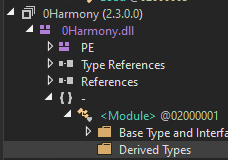
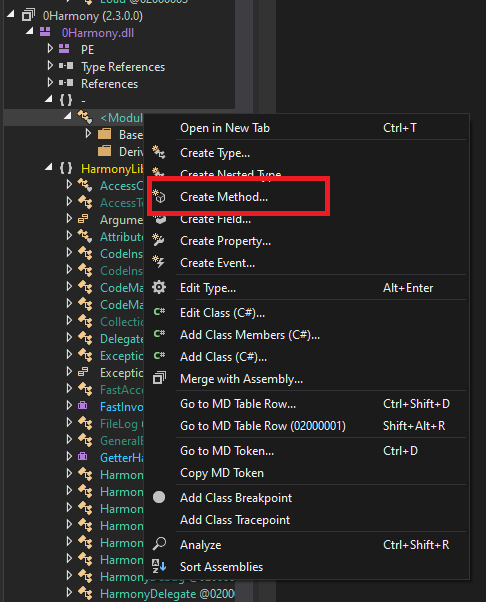
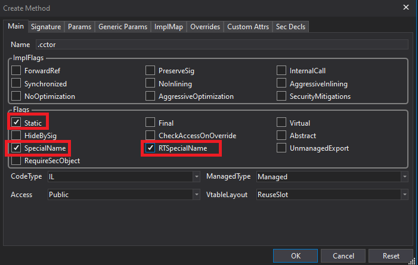
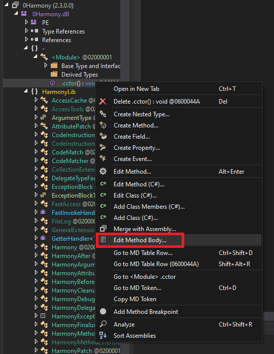
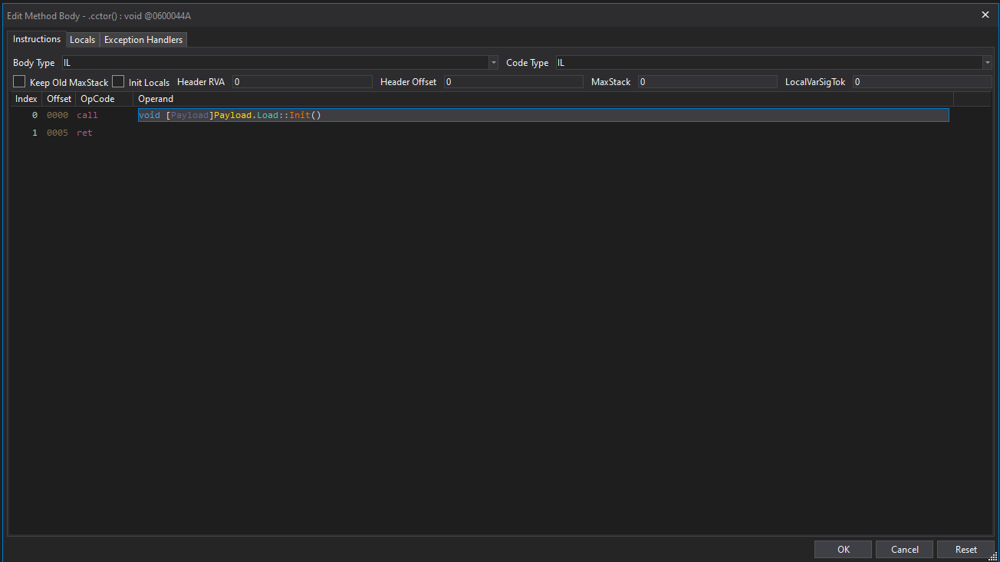

# Instructions On Loading

## Finding A Referenced DLL
1. Go to your unity folder. Example:```Program Files (x86)\Steam\steamapps\common\7 Days To Die```
2. Go to your managed folder. Example ```Program Files (x86)\Steam\steamapps\common\7DaysToDie_Data\Managed```
3. In here you will find many dlls, you need to find one that the game references but doesn't initialise with. System dlls and 3rd party dlls work well. I am using: ```0Harmony.dll```
4. Edit the dll for an entry point. Open it in dnspy and fully expand down to the module class:
<p align="left">
  
</p>
5. Right click the module class and click create method:
<p align="left">
  
</p>
6. In the create method panel type .cctor as the name and then tick Static, SpecialName and RTSpecialName. Save it.Your panel should look like the screenshot:
<p align="left">
  
</p>
7. Right click this new .cctor function and edit the method body(make sure you dragged in the payload or implemented a byte array with an initilize function into the module):
<p align="left">
  
</p>
8. Add 2 new instructions. A Call which you will set to call your initialise function and then a return:
<p align="left">
  
</p>
<br>
9. Now you have a nice compiled dll which contains your payload you can just edit the game name and registry directory for the game to place it in the location for the game and then call the load function to load it.<br>
10. Now its installed in place the next time the game is ran all your malicious code will run.

</br>

```Note that to implement this correctly you should implement an internal byte array into the referenced module for your payload. So it is a single file that initialises the payload.```
